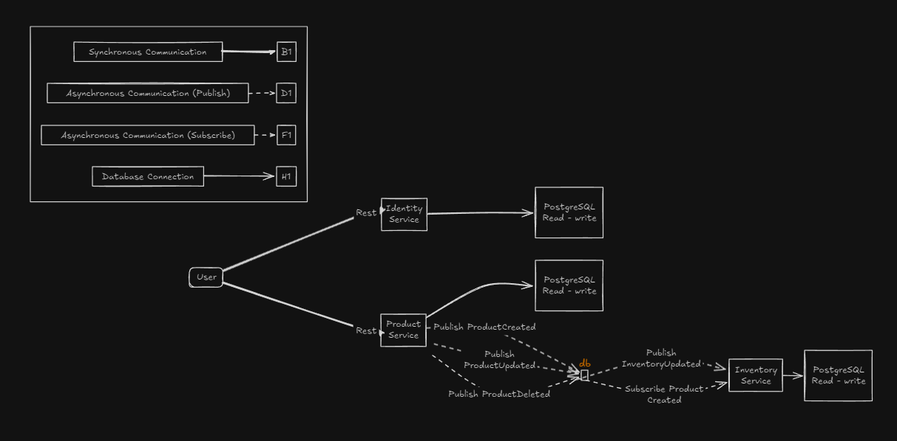
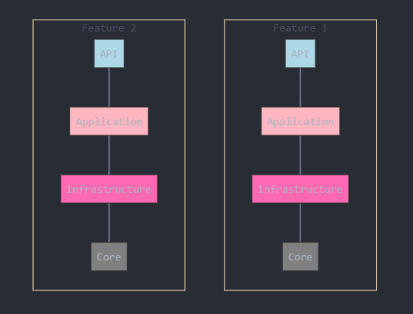

## Kube Watch
```bash

make docker-compose_infra_up
make run_products_service
make run_identities_service


IF MAKE NOT INSTALLED


docker-compose -f deployments/docker-compose/infrastructure.yaml up --build
cd internal/services/product_service/ && 	go run ./cmd/main.go
cd internal/services/identity_service/ && 	go run ./cmd/main.go
```

# API Documentation

#### Direct POSTMAN Collection file is in api-test folder.

## Authentication

### Get Access Token
To obtain an access token, use the following command:

```bash
curl --location 'http://localhost:5002/connect/token?grant_type=password&client_id=clientId&client_secret=clientSecret&scope=all&username=admin&password=admin'
```

### Validate Access Token
To validate an access token, use this command:

```bash
curl --location 'http://localhost:5002/validate-token' \
--header 'Content-Type: application/json' \
--header 'accept: application/json' \
--header 'authorization: Bearer YOUR_ACCESS_TOKEN'
```

## Service Health Checks

### Identity Service Health Check
Check the health of the Identity service with the following command:

```bash
curl --location 'http://localhost:5002'
```

### Product Service Health Check
Verify the Product service health by executing:

```bash
curl --location 'http://localhost:5000'
```

## Product Operations

### Create Product
To create a new product, use the command below:

```bash
curl --location 'http://localhost:5000/api/v1/products' \
--header 'accept: application/json' \
--header 'Content-Type: application/json' \
--header 'authorization: Bearer YOUR_ACCESS_TOKEN' \
--data '{
  "description": "test-desc",
  "name": "test-product",
  "price": 20,
  "inventoryId": 1,
  "count": 100
}'
```

### Update Product
To update an existing product, replace `{product-id}` with the UUID of the product you wish to update, and run:

```bash
curl --location --request PUT 'http://localhost:5000/api/v1/products/{product-id}' \
--header 'accept: application/json' \
--header 'Content-Type: application/json' \
--header 'authorization: Bearer YOUR_ACCESS_TOKEN' \
--data '{
  "description": "test-desc-updated",
  "name": "test-product-updated",
  "price": 40,
  "inventoryId": 1,
  "count": 100
}'
```

> **Note**: Replace `YOUR_ACCESS_TOKEN` with the actual token received from the authentication endpoint.

## Environment Variables

- **Identity API Base URL**: `http://localhost:5002`
- **Product API Base URL**: `http://localhost:5000`

# Golang Microservices

The main idea of creating this project is implementing an infrastructure for up and running distributed system with the latest technology and architecture like Vertical Slice Architecture, OpenTelemetry, RabbitMq in Golang, and we will not deal mainly with business.
 

## The Domain And Bounded Context - Service Boundary



## Technologies - Libraries

- ✔️ **[`labstack/echo`](https://github.com/labstack/echo)** - High performance, minimalist Go web framework
- ✔️ **[`go-gorm/gorm`](https://github.com/go-gorm/gorm)** - The fantastic ORM library for Go, aims to be developer friendly
- ✔️ **[`sirupsen/logrus`](https://github.com/sirupsen/logrus)** - Logrus is a structured logger for Go
- ✔️ **[`streadway/amqp`](https://github.com/streadway/amqp)** - Go RabbitMQ Client Library
- ✔️ **[`spf13/viper`](https://github.com/spf13/viper)** - Go configuration with fangs
- ✔️ **[`swaggo/echo-swagger`](https://github.com/swaggo/echo-swagger)** - Echo middleware to automatically generate RESTful API documentation
- ✔️ **[`mehdihadeli/Go-MediatR`](https://github.com/mehdihadeli/Go-MediatR)** - This package is a Mediator Pattern implementation in Go
- ✔️ **[`go-playground/validator`](https://github.com/go-playground/validator)** - Implements value validations for structs and individual fields based on tags
- ✔️ **[`open-telemetry/opentelemetry-go`](https://github.com/open-telemetry/opentelemetry-go)** - Implementation of OpenTelemetry in Go for distributed-tracing
- ✔️ **[`meysamhadeli/problem-details`](https://github.com/meysamhadeli/problem-details)** - Error Handler for mapping our error to standardized error payload to client
- ✔️ **[`go-resty/resty`](https://github.com/go-resty/resty)** - Simple HTTP and REST client library for Go (inspired by Ruby rest-client)
- ✔️ **[`grpc/grpc-go`](https://github.com/grpc/grpc-go)** - The Go language implementation of gRPC. HTTP/2 based RPC
- ✔️ **[`go-oauth2/oauth2`](https://github.com/go-oauth2/oauth2)** - An open protocol to allow secure authorization in a simple and standard method
- ✔️ **[`stretchr/testify`](https://github.com/stretchr/testify)** - A toolkit with common assertions and mocks that plays nicely with the standard library
- ✔️ **[`uber-go/fx`](https://github.com/uber-go/fx)** - Fx is a dependency injection system for Go
- ✔️ **[`cenkalti/backoff`](https://github.com/cenkalti/backoff)** - This is a Go port of the exponential backoff algorithm
- ✔️ **[`stretchr/testify`](https://github.com/stretchr/testify)** - A toolkit with common assertions and mocks that plays nicely with the standard library
- ✔️ **[`testcontainers/testcontainers-go`](https://github.com/testcontainers/testcontainers-go)** - it's a package to create and clean up container for automated integration/smoke tests
- ✔️ **[`avast/retry-go`](https://github.com/avast/retry-go)** - Simple golang library for retry mechanism
- ✔️ **[`ahmetb/go-linq`](https://github.com/ahmetb/go-linq)** - .NET LINQ capabilities in Go

## Structure of Project

In this project I used [vertical slice architecture](https://jimmybogard.com/vertical-slice-architecture/) and [feature folder structure](http://www.kamilgrzybek.com/design/feature-folders/) to structure my files.

I used [RabbitMQ](https://github.com/rabbitmq) as my MessageBroker for async communication between microservices using the eventual consistency mechanism. 

Microservices are `event based` which means they can publish and/or subscribe to any events occurring in the setup. By using this approach for communicating between services, each microservice does not need to know about the other services or handle errors occurred in other microservices.

I treat each request as a distinct use case or slice, encapsulating and grouping all concerns from front-end to back.
When adding or changing a feature in an application in n-tire architecture, we are typically touching many "layers" in an application. We are changing the user interface, adding fields to models, modifying validation, and so on. Instead of coupling across a layer, we couple vertically along a slice. We `minimize coupling` `between slices`, and `maximize coupling` `in a slice`.

With this approach, each of our vertical slices can decide for itself how to best fulfill the request. New features only add code, we're not changing shared code and worrying about side effects.

<div align="center">
  
</div>

Instead of grouping related action methods in one endpoint, I used the [REPR pattern](https://deviq.com/design-patterns/repr-design-pattern). Each action gets its own small endpoint, and for communication between our endpoint and handlers, I use [Go-MediatR](https://github.com/mehdihadeli/Go-MediatR) for decouple our endpoint to handlers directly, and it gives use some pipeline behavior for logging, caching, validation and... easily.

The use of the [mediator pattern](https://golangbyexample.com/mediator-design-pattern-golang/) in my endpoints creates clean and thin endpoint. By separating action logic into individual handlers we support the [Single Responsibility Principle](https://en.wikipedia.org/wiki/Single_responsibility_principle) and [Don't Repeat Yourself principles](https://en.wikipedia.org/wiki/Don%27t_repeat_yourself), this is because traditional controllers tend to become bloated with large action methods and several injected `Services` only being used by a few methods.

I used CQRS to decompose my features into small parts that makes our application:

- Maximize performance, scalability and simplicity.
- Easy to maintain and add features to. Changes only affect one command or query, avoiding breaking changes or creating side effects.
- It gives us better separation of concerns and cross-cutting concern (with help of mediatr behavior pipelines), instead of bloated service classes doing many things.

Using the CQRS pattern, we cut each business functionality into vertical slices, for each of these slices we group classes (see [technical folders structure](http://www.kamilgrzybek.com/design/feature-folders)) specific to that feature together (command, handlers, infrastructure, repository, controllers, etc). In our CQRS pattern each command/query handler is a separate slice. This is where you can reduce coupling between layers. Each handler can be a separated code unit, even copy/pasted. Thanks to that, we can tune down the specific method to not follow general conventions (e.g. use custom postgresql query or even different storage). In a traditional layered architecture, when we change the core generic mechanism in one layer, it can impact all methods.


